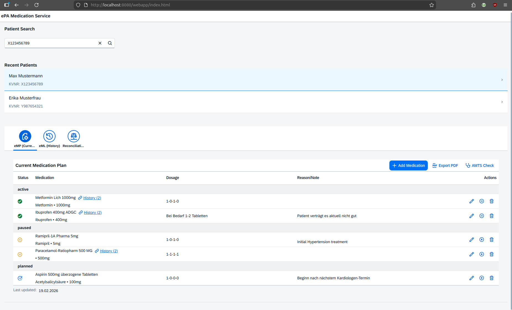
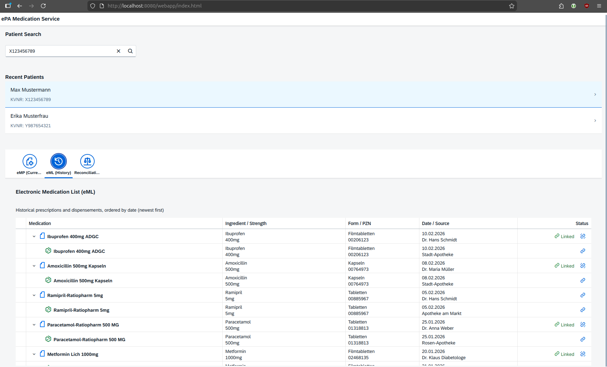
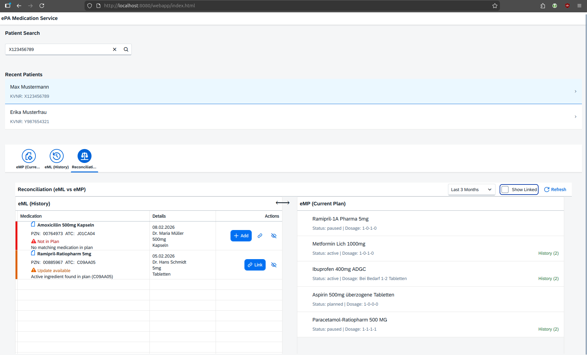
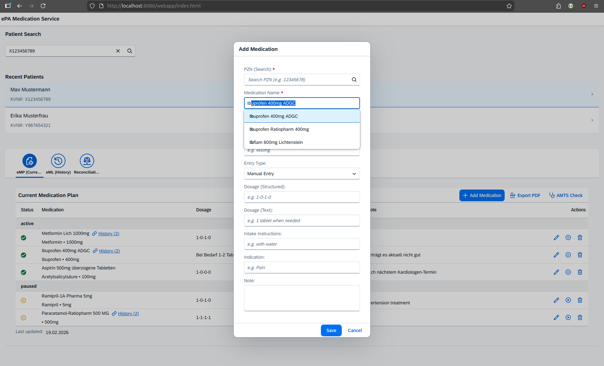
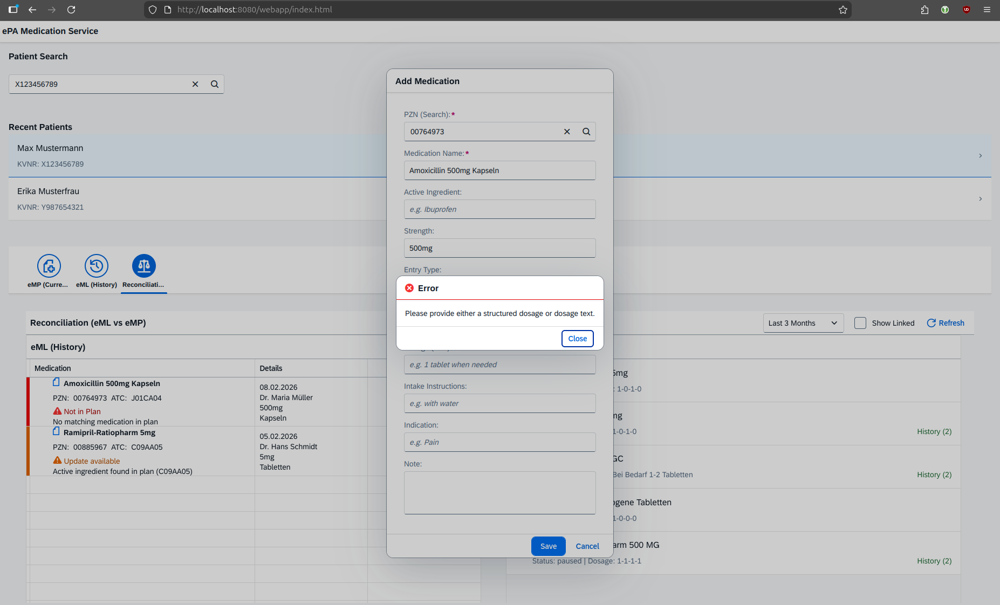
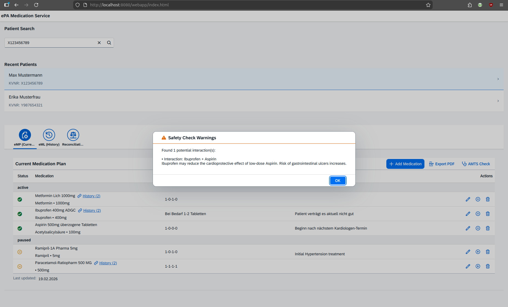
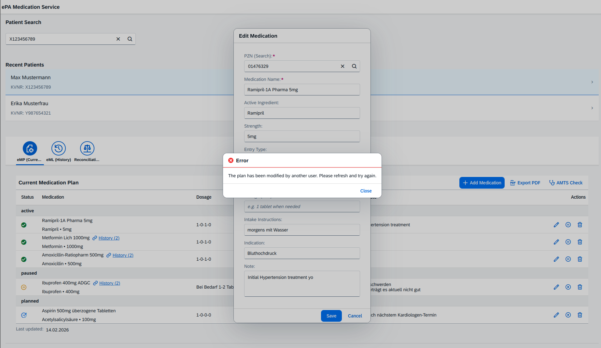

# ePA Medication Service Prototype

This project is a prototype for the German Electronic Patient Record (ePA) Medication Service UI. It simulates the interaction between the Electronic Medication List (eML) and the Electronic Medication Plan (eMP).

## Tech Stack

- **Backend**: Java 21, Quarkus (RESTEasy Reactive, Jackson)
- **Frontend**: SAPUI5 (OpenUI5)

## What is this?

This is a UI prototype for the **German ePA (electronic patient record) Medication Service**, implementing the *dgMP* (digitales Medikationsprozess) use cases defined in the Implementation Guide ePA Medication Service v1.3.0. It simulates the daily workflow of physicians and pharmacists who view, manage, and reconcile a patient's **electronic Medication List (eML)** — historical prescriptions and dispensements — and **electronic Medication Plan (eMP)** — the current active therapy plan. The backend uses in-memory FHIR R4 JSON fixtures (FHIR Bundle with Medication, MedicationRequest, MedicationStatement, MedicationDispense resources) and does not connect to a real TI infrastructure.

## dgMP Use Cases

| # | Use Case | Description | Status |
|---|---|---|---|
| US0 | Patient Selection | KVNR search + recent patients sidebar | ✅ Implemented |
| US1 | View eML | Historical prescriptions & dispensements, sorted by date | ✅ Implemented |
| US2 | View eMP | Current medication plan grouped by status | ✅ Implemented |
| US3 | Duplicate Detection | PZN / ATC / ASK match when adding to plan | ✅ Implemented |
| US4 | Reconciliation | eML vs eMP discrepancy view with status taxonomy | ✅ Implemented |
| US5 | Create Manual eMP Entry | PZN search + freetext form, with autocomplete | ✅ Implemented |
| US6 | Edit eMP Entry | Edit dosage, instructions, indication inline | ✅ Implemented |
| US7 | Manage Status | Pause / reactivate / delete eMP entries | ✅ Implemented |
| US8 | Link / Unlink eML ↔ eMP | Hard-link via `medicationPlanIdentifier` UUID | ✅ Implemented |
| US9 | Prescription Workflow Integration | Add to eMP during e-prescription creation | ❌ Deferred |
| US10 | Dispensing Workflow Integration | Update eMP with actually dispensed product | ❌ Deferred |
| US11 | PDF Export | Bundesmedikationsplan format PDF | ⚠️ Placeholder |
| US12 | AMTS Safety Check | Simulated drug-drug interaction warnings | ✅ Implemented |

## Screenshots

**Electronic Medication Plan (eMP)** — active, paused, and planned entries with inline actions and therapy history links



**Electronic Medication List (eML)** — historical prescriptions and dispensements, grouped by prescription with link status



**Reconciliation View** — side-by-side eML vs eMP with colour-coded status (red = not in plan, orange = active ingredient match)



**Add Medication Dialog** — PZN search with medication name autocomplete



**Add Medication — Validation** — dosage validation error shown from within the reconciliation workflow



**AMTS Safety Check** — simulated drug-drug interaction warning (Ibuprofen + Aspirin)



**Edit Medication — Concurrency Conflict** — optimistic concurrency error when the plan was modified by another user mid-edit



## Getting Started

### Prerequisites

- Java 21+
- Maven 3.8+

### Running the Application

1. Clone the repository.
2. Run the following command in the project root:

```bash
mvn quarkus:dev
```

3. Open your browser and navigate to `http://localhost:8080/webapp/index.html`.

## Testing

Run tests with:

```bash
mvn test
```

## Project Structure

```
dgmp-openui5-prototype/
├── src/main/java/de/servicehealth/epa/medication/
│   ├── MedicationResource.java      # REST endpoints (eML, eMP, reconciliation, link/unlink)
│   ├── MedicationService.java       # Business logic: loading, caching, linking, duplicates
│   ├── MedicationDatabase.java      # In-memory medication catalog (PZN search)
│   └── model/                       # Java DTOs (MedicationRequest, MedicationStatement, …)
│
├── src/main/resources/
│   ├── application.properties       # Quarkus configuration (port, CORS, logging)
│   ├── fixtures/                    # JSON fixture files with sample patient data
│   └── META-INF/resources/webapp/
│       ├── index.html               # SAPUI5 app shell
│       ├── controller/
│       │   ├── BaseController.js    # Shared helpers: KVNR listener, data loaders, dialog
│       │   ├── PatientSelection.controller.js
│       │   ├── MedicationPlan.controller.js
│       │   ├── MedicationList.controller.js
│       │   ├── Reconciliation.controller.js
│       │   ├── AddMedicationDialog.controller.js
│       │   └── DuplicateDialog.controller.js
│       ├── view/                    # SAPUI5 XML views and fragments
│       └── model/
│           ├── formatter.js         # Date / status / count formatters
│           └── AMTSSimulator.js     # Client-side drug interaction simulation
│
├── specs/001-epa-medication-ui/     # Feature specifications (github-spec-kit)
│   ├── spec.md                      # User stories and acceptance criteria (US0–US12)
│   ├── data-model.md                # DTO schema and state transitions
│   ├── reconciliation-spec.md       # Reconciliation status taxonomy
│   └── tasks.md                     # Implementation task history
│
├── openspec/                        # Change management (openspec)
│   ├── specs/                       # Baseline / merged specs
│   └── changes/                     # Per-change artifacts (proposal → specs → design → tasks)
│
└── images/                          # UI screenshots for documentation
```
