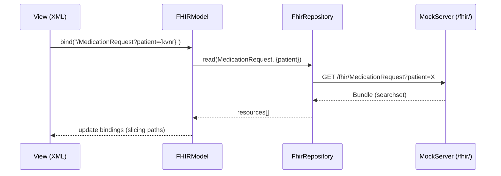
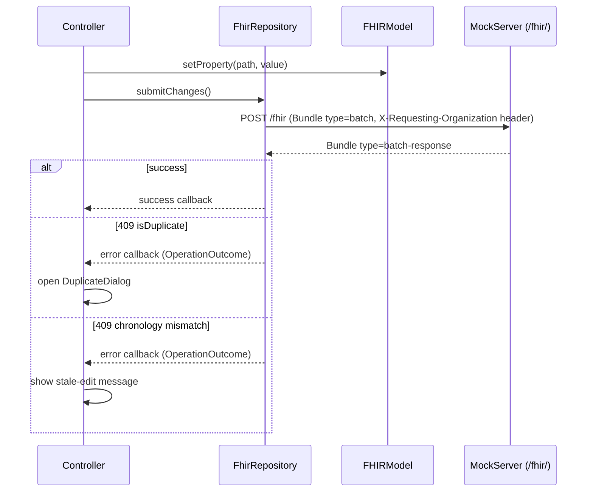

## Executive Summary

This change replaces the prototype's bespoke flat JSON data layer with genuine FHIR R4 resources, end-to-end. For users and clinical stakeholders: **all screens and use cases (US0–US12) will continue to work exactly as before** — the migration is internal plumbing; no workflows change. What changes is that the data the prototype handles will match the structure used by the real ePA Medication Service, making the prototype a trustworthy reference for integration and compliance discussions.

The migration happens in three self-contained phases. After each phase the application remains fully runnable and rollback is a single git revert. Phase 1 converts test data (fixtures) to proper FHIR format. Phase 2 adds FHIR-style API endpoints to the mock server. Phase 3 rewires the UI to consume those endpoints natively via the `openui5-fhir` library.

Security and privacy note: moving mutations to FHIR Batch Bundles (`POST /fhir`) eliminates patient identifiers (KVNR) from URLs, aligning the prototype with the privacy posture of the real ePA system where PHI never appears in HTTP paths.

---

## Architecture

### Read flow



### Write flow (batch)



---

## Context

The prototype currently uses `JSONModel` + raw `fetch()` calls against custom REST endpoints (`/api/medications/plan/<kvnr>`, `/api/medications/list/<kvnr>`) that return a bespoke flat JSON structure. All controllers read from flat property paths (`oEntry.medicationName`, `oEntry.pzn`) and write back via direct model property sets. There is no awareness of FHIR resource types, systems, or reference semantics anywhere in the client stack.

The real ePA Medication Service is a FHIR Data Service. Moving the prototype to genuine FHIR R4 requires changes at three layers:
1. **Fixtures** — static test data converted to FHIR R4 Bundle JSON
2. **Mock server** — endpoints changed to FHIR REST conventions and return FHIR resources
3. **Client** — `JSONModel` replaced by `openui5-fhir` `FHIRModel`; controller bindings rewritten

Current technology baseline: OpenUI5 (SAPUI5-compatible), Maven project, fixtures in `src/main/resources/fixtures/`, controllers using `fetch()` in `BaseController.js`.

---

## Goals / Non-Goals

**Goals:**
- Replace fixture format with valid FHIR R4 `Bundle` JSON (type `searchset` for reads, `batch-response` for writes)
- Expose FHIR REST endpoints from mock server at base path `/fhir/` (FHIR base URL)
- Replace `JSONModel` with `openui5-fhir` `FHIRModel` as the data model for medication resources
- Rewrite controller property bindings to use FHIR path expressions with slicing (`[system=...]`) — zero positional array indices in bindings
- Migrate `patients.json` to FHIR `Patient` resources — required for full `FHIRModel` reverse chaining and ValueSet binding
- Keep application behaviour (all US0–US12 use cases) unchanged

**Non-Goals:**
- Full FHIR server compliance (no `CapabilityStatement`, no SMART on FHIR auth)
- AMTS (`AMTSSimulator.js`) refactoring — it operates on derived local data, not raw FHIR
- PDF export

---

## Decisions

### Decision 1: Use `openui5-fhir` `FHIRModel` — no custom adapter

**Chosen**: `openui5-fhir` (`sap/fhir/model/r4/FHIRModel`)

**Rationale**: A custom adapter would need to re-implement Bundle request grouping, `Reference` resolution, pagination, ValueSet binding, and slicing path filtering — all features that `FHIRModel` already provides. The maintenance cost is prohibitive and the correctness ceiling is lower.

**Version**: `openui5-fhir` v2.4.0. The library requires OpenUI5 `> 1.58.0` and was last tested against 1.120.6. The project currently loads OpenUI5 from an **unversioned CDN endpoint** (`openui5.hana.ondemand.com/resources/sap-ui-core.js`), which resolves to the latest stable release (~1.130+ as of early 2026) — above the tested ceiling. **Action required in Phase 1**: pin `index.html` to a specific OpenUI5 version (target `1.120.6` unless a later version is confirmed compatible) so the entire development cycle runs on a known-good combination.

**`X-Requesting-Organization` header**: All mutating FHIR requests must include this custom header (required by the `emp-link-identifier` spec). `FHIRModel` supports injecting custom HTTP headers via the `httpHeaders` initialisation option:
```js
new FHIRModel("/fhir", {
  httpHeaders: { "X-Requesting-Organization": "<org-identifier>" }
})
```
The org identifier value is sourced from the `ui` JSONModel at session start. This configuration is a mandatory item in the `fhir-client-model` spec.

**Integration**: `FHIRModel` is configured with the mock server's FHIR base URL (`/fhir`) and replaces the single `JSONModel` ("app") for medication data. A separate lightweight `JSONModel` ("ui") is retained for pure UI state (busy flags, dialog state, current KVNR) that has no FHIR equivalent.

```
models.js
  createFHIRModel()   → new FHIRModel("/fhir", { httpHeaders: {...}, ... })  ← medication resources
  createUIModel()     → new JSONModel({ currentKVNR, busy, orgId, ... })     ← UI state only
```

**`FhirRepository` abstraction layer**: Controllers do not call `FHIRModel` directly. Instead, a thin `FhirRepository` module wraps the five operations actually used by the prototype:

```js
// model/FhirRepository.js
read(resourceType, searchParams)   // → Promise<Resource[]>
create(resource)                   // → void (deferred, needs submitChanges)
update(resource)                   // → void (deferred)
remove(resourceType, id)           // → void (deferred)
submitChanges()                    // → Promise<batchResponse>
```

This decouples all controllers from raw `FHIRModel` API calls. If `openui5-fhir` must be replaced, only `FhirRepository.js` changes — controllers are unaffected.

**Fallback criteria**: If `openui5-fhir` v2.4.0 is incompatible with the pinned OpenUI5 version (confirmed during Phase 1), or if a critical security issue arises with no available patch, the fallback is a custom adapter implementing the five `FhirRepository` methods using plain `fetch()` + manual Bundle construction. The adapter scope is bounded to what `FhirRepository` exposes — it does not need to replicate the full `FHIRModel` API. This fallback is a conscious last resort; the primary bet is `openui5-fhir`.

### Decision 2: Mock server exposes FHIR REST endpoints at `/fhir/`

**Chosen**: Add FHIR REST routes to the existing mock server alongside (not replacing) the current `/api/` routes during transition.

FHIR endpoints needed:

| FHIR Request | Maps to |
|---|---|
| `GET /fhir/MedicationRequest?patient=<kvnr>` | eMP bundle for patient |
| `GET /fhir/MedicationStatement?patient=<kvnr>&_include=MedicationStatement:based-on` | eML prescriptions + linked MedicationRequests |
| `GET /fhir/MedicationDispense?patient=<kvnr>&_include=MedicationDispense:prescription` | eML dispensements + linked MedicationRequests |
| `GET /fhir/Patient?identifier=<kvnr>` | Patient resource lookup |
| `GET /fhir/Medication?name:contains=<term>` | Medication name autocomplete (replaces `/api/medications/search`) |
| `POST /fhir` (batch) | All mutating operations (add/update/link/unlink) |

`FHIRModel` issues its own HTTP requests based on the model binding context. The mock server must parse standard FHIR search parameters (`patient`, `_include`, `name:contains`) and return properly shaped `Bundle` resources. Only the search parameters listed above are required; the mock server does not need to be a general-purpose FHIR server.

**Alternative considered**: Keep `/api/` URLs and make the server return FHIR-shaped JSON. Rejected: `FHIRModel` requires a FHIR-compliant base URL and will not work with custom REST paths.

### Decision 3: FHIR Batch Bundles for all mutations

All write operations (`add-emp-entry`, `update-emp-entry`, `link-emp`, `unlink-emp`, `status change`, `delete`) are sent as a single `POST /fhir` with a `Bundle` of type `batch`. This:
- Keeps PHI out of URLs (no KVNR in PUT/PATCH paths)
- Matches the real ePA write pattern
- Is handled automatically by `FHIRModel`'s request grouping when `submitChanges()` is called

The mock server validates and processes batch Bundles, returning a `batch-response` Bundle where each entry carries its own `response.status`.

**Provenance**: `EPAActivityProvenance` and `EMPChronologyProvenance` are **server-generated** on every successful write. The mock server includes them as additional entries in the `batch-response` Bundle. The client does not construct provenance resources; `FHIRModel` processes the `batch-response` and updates its internal cache with returned resources including provenance entries. Binding to provenance data from the client side is **out of scope** for Phase 3 — provenance is server-side audit state only.

**Per-entry error handling**: `DuplicateDialog` (HTTP 409 `isDuplicate`) and chronology mismatch (`MEDSVC_EMP_CHRONOLOGY_ID_MISMATCH`) return as `response.status: "409"` entries within the `batch-response`. `FHIRModel` fires error callbacks per failed entry. Controllers subscribe to these callbacks to trigger `DuplicateDialog` or show a stale-edit message. The mock server MUST return structured FHIR `OperationOutcome` resources as the body of failed `batch-response` entries so controllers can distinguish duplicate from chronology errors by `OperationOutcome.issue.code`.

### Decision 4: Slicing syntax for all coding array bindings

`openui5-fhir` supports secondary-index (slicing) path segments of the form `[<property>=<value>]`. All controller and view bindings that access elements within a FHIR array MUST use this form.

Examples:
```
# ATC code
medicationCodeableConcept/coding[system=http://www.whocc.no/atc]/code

# PZN
medicationCodeableConcept/coding[system=http://fhir.de/CodeSystem/ifa/pzn]/code

# medicationPlanIdentifier
identifier[system=https://gematik.de/fhir/sid/emp-identifier]/value
```

Positional index syntax (`/coding/0/code`) is **prohibited** in all bindings.

### Decision 5: Fixture resources conform to full ePA IG profiles

**Chosen**: Fixtures use full ePA Implementation Guide profiles (not plain FHIR R4 base resources).

**Rationale**: The prototype's purpose is to faithfully represent the real ePA Medication Service, which operates under strict profile constraints inside a trusted execution environment (VAU). Using base R4 resources would produce incorrect UI bindings — the ePA IG defines specific extensions, coding systems, and resource shapes (e.g. `KBV_PR_ERP_Medication`, `GEM_ERP_PR_MedicationDispense`) that the production frontend must handle. AMTS-relevant additional information and complex medication linkages in particular depend on ePA-specific extension URLs being present in the fixtures.

**Implication**: Phase 1 (fixture rewriting) requires referencing the ePA Medication Service IG profiles, not just the FHIR R4 base spec.

### Decision 6: `Patient` resource migrated in this change (not deferred)

**Chosen**: `patients.json` migrated to FHIR `Patient` resources as part of Phase 1.

**Rationale**: `FHIRModel` is designed around FHIR context — binding UI components to paths like `/Patient/123` and resolving reverse chaining (e.g. `MedicationRequest?patient=<id>`) only works correctly when `Patient` is also a first-class FHIR resource. Deferring Patient migration forces a fractured architecture where `FHIRModel` handles medication resources while a legacy `JSONModel` holds patient state, preventing native use of reverse chaining and ValueSet binding for patient-level data (e.g. gender from a server-provided code list). The additional scope is small (one fixture file, one controller).

### Decision 7: `MedicationDispense` for dispensements — not `MedicationStatement`

Currently dispensements are nested under their parent prescription in the fixture (`dispensations: [...]`). In FHIR R4 and the ePA IG (`GEM_ERP_PR_MedicationDispense`), dispensements are a distinct resource type: `MedicationDispense`. Using `MedicationStatement` for dispensements would violate the ePA IG profiles (Decision 5) and make `basedOn` references illegal — `MedicationStatement.basedOn` only accepts `Reference(MedicationRequest | CarePlan | ServiceRequest)`, not another `MedicationStatement`.

Mapping:
- **`MedicationStatement`** — eML prescription event (one per prescription)
- **`MedicationDispense`** — eML dispensement event; links back via `MedicationDispense.authorizingPrescription → MedicationRequest` and `MedicationDispense.partOf → MedicationStatement`

The `MedicationList` controller assembles the history view by querying:
```
GET /fhir/MedicationStatement?patient=<kvnr>&_include=MedicationStatement:based-on
GET /fhir/MedicationDispense?patient=<kvnr>&_include=MedicationDispense:prescription
```
and grouping `MedicationDispense` entries under their linked `MedicationStatement` by `authorizingPrescription` reference.

### Decision 8: Reconciliation algorithm reads from a derived plain array

The Reconciliation view (US4) soft-match algorithm compares `MedicationStatement` and `MedicationRequest` entries by ATC code and PZN. This is a client-side multi-resource join that does not map naturally to `FHIRModel` list bindings (which bind a single resource type per binding).

**Chosen approach**: The `Reconciliation` controller calls `FhirRepository.read()` to fetch the current `MedicationRequest` and `MedicationStatement` bundles as plain JavaScript arrays, then runs the existing soft-match algorithm over those arrays unchanged. The results are stored in the `ui` JSONModel under `/reconciliation` for view binding. Data is never held twice — the derived array is rebuilt on each reconciliation load.

**Reconciliation input contract** (fields the algorithm requires; source is authoritative):

*eML side — from `MedicationStatement`:*

| Derived field | Source FHIR path |
|---|---|
| `id` | `MedicationStatement.id` |
| `medicationName` | `MedicationStatement.medicationCodeableConcept.text` |
| `atcCode` | `MedicationStatement.medicationCodeableConcept.coding[system=http://www.whocc.no/atc].code` |
| `pzn` | `MedicationStatement.medicationCodeableConcept.coding[system=http://fhir.de/CodeSystem/ifa/pzn].code` |
| `medicationPlanIdentifier` | `MedicationStatement.identifier[system=https://gematik.de/fhir/sid/emp-identifier].value` |
| `basedOnRef` | `MedicationStatement.basedOn[0].reference` |
| `authoredDate` | `MedicationStatement.dateAsserted` |

*eMP side — from `MedicationRequest`:*

| Derived field | Source FHIR path |
|---|---|
| `id` | `MedicationRequest.id` |
| `medicationName` | `MedicationRequest.medicationCodeableConcept.text` |
| `atcCode` | `MedicationRequest.medicationCodeableConcept.coding[system=http://www.whocc.no/atc].code` |
| `pzn` | `MedicationRequest.medicationCodeableConcept.coding[system=http://fhir.de/CodeSystem/ifa/pzn].code` |
| `medicationPlanIdentifier` | `MedicationRequest.identifier[system=https://gematik.de/fhir/sid/emp-identifier].value` |
| `status` | `MedicationRequest.status` |

These mappings are the contract between the FHIR layer and the reconciliation algorithm. Any change to fixture field names or coding systems must be reflected here first.

### Decision 9: `AMTSSimulator` receives a derived plain array — not FHIR bindings

`AMTSSimulator.js` checks drug interactions over active `MedicationRequest` entries. After Phase 3, the `MedicationPlan` controller fetches active entries via `FhirRepository.read()`, extracts the relevant FHIR paths into a plain array, and passes that array to `AMTSSimulator.checkInteractions()`. `AMTSSimulator.js` itself is **not modified** — it continues to consume the same flat object shape. FHIR path resolution is the controller's responsibility; `AMTSSimulator` remains FHIR-unaware.

**AMTS input contract** (fields `AMTSSimulator.checkInteractions()` requires; source is authoritative):

| Derived field | Source FHIR path |
|---|---|
| `id` | `MedicationRequest.id` |
| `medicationName` | `MedicationRequest.medicationCodeableConcept.text` |
| `atcCode` | `MedicationRequest.medicationCodeableConcept.coding[system=http://www.whocc.no/atc].code` |
| `pzn` | `MedicationRequest.medicationCodeableConcept.coding[system=http://fhir.de/CodeSystem/ifa/pzn].code` |
| `activeIngredient` | `MedicationRequest.medicationCodeableConcept.coding[system=http://fhir.de/CodeSystem/ask].display` |
| `status` | `MedicationRequest.status` |

Only entries with `status = "active"` are passed to `AMTSSimulator`. This is the contract boundary — if `AMTSSimulator` needs additional fields in future, this table must be updated before the controller is changed.

### Decision 10: Phased migration — fixtures → server → client

Migrating all three layers simultaneously is high-risk. The sequence:

1. **Phase 1 — Fixtures**: Rewrite `medication-plan-*.json` and `medication-list-*.json` as FHIR R4 Bundles. Existing `/api/` endpoints updated to serve them (still flattened for the old client). This is purely additive.
2. **Phase 2 — Mock server FHIR routes**: Add `/fhir/` endpoints. Old `/api/` routes remain for fallback.
3. **Phase 3 — Client**: Add `openui5-fhir` dependency, replace `JSONModel` with `FHIRModel` in `models.js`, rewrite controller bindings and `formatter.js`. Remove old `fetch()` calls and `/api/` routes.

This allows running the old and new paths in parallel during development and rolling back to Phase 2 state if Phase 3 issues arise.

---

## Risks / Trade-offs

**`openui5-fhir` maintenance status** → The library has had limited activity since 2022. Pin to a specific version and test against the project's OpenUI5 version before committing. Mitigation: add integration smoke tests for FHIRModel binding after Phase 3.

**FHIR path learning curve in controllers** → Slicing syntax is unfamiliar; developers may accidentally revert to positional indices. Mitigation: add a code review checklist item and document canonical path patterns in `fhir-client-model` spec.

**Mock server FHIR search parameter parsing** → The mock server currently does trivial path-based routing. Implementing `_include`, `_revinclude`, and chained search parameters is non-trivial. Mitigation: implement only the search parameters actually used by the prototype; document the supported subset.

**Formatter.js coupling** → `formatter.js` uses flat property names (`atcCode`, `medicationName`) passed as primitive values from controller code. After migration, formatters will receive FHIR `CodeableConcept` or `Dosage` objects. Mitigation: update formatter signatures in Phase 3; this is the most likely source of runtime regressions.

**Chronology / concurrency (`chronologyId`)** → Currently a flat field on the plan entry. In FHIR this is modelled via `EMPChronologyProvenance`. The `update-emp-entry` batch entry must include the acknowledged chronology ID as a Provenance reference. Mitigation: document the exact batch entry shape in `emp-link-identifier` delta spec.

**`isEMP` extension URL ownership** → The `emp-link-identifier` spec uses an `isEMP` flag on `basedOn` references. The canonical URL for this extension must be sourced from the ePA Medication Service IG. If no canonical URL is defined in the IG, a prototype-local URL must be minted and documented explicitly in the `fhir-resource-model` spec to avoid conflicts with actual ePA IG fixtures. Mitigation: verify against the IG before writing Phase 1 fixtures; document the chosen URL in `fhir-resource-model`.

---

## Migration Plan

| Phase | Deliverable | Rollback |
|---|---|---|
| 1 | OpenUI5 CDN URL pinned to `1.120.6`; FHIR R4 Bundle fixture files (incl. `Patient`) written; `/api/` server-side flattening updated to serve them | Revert `index.html` pin + fixture files + server flattening logic |
| 2 | `/fhir/` endpoints on mock server; old `/api/` routes intact | Disable `/fhir/` routes |
| 3 | `openui5-fhir` integrated; `PatientSelection` + all medication controllers rewritten; `AMTSSimulator` input adapter added; `/api/` routes removed | Git revert Phase 3 commits |

---

## Testing and Validation

Each phase has explicit gates. Phase N+1 does not start until all gates for Phase N pass.

### Phase 1 gates — Fixtures

| Test | How |
|---|---|
| All fixture Bundles are valid FHIR R4 JSON | Run `fhir-validator` (HL7 validator CLI) against each file; integrate as Maven `validate` step |
| All fixture Bundles pass ePA IG profile validation | Same validator, with ePA IG package loaded (`de.gematik.epa.medication#<version>`) |
| Existing `/api/` endpoints still return data (regression) | Existing manual smoke test: open app, select patient, verify eMP and eML load |

### Phase 2 gates — Mock server FHIR routes

| Test | How |
|---|---|
| Each `/fhir/` endpoint returns a valid FHIR Bundle | REST-Assured contract tests (Quarkus test profile) against the running mock server |
| `_include` parameters return linked resources | Contract test: `GET /fhir/MedicationStatement?patient=X&_include=MedicationStatement:based-on` includes `MedicationRequest` entries |
| Batch `POST /fhir` returns `batch-response` with correct per-entry status | Contract test: submit a batch with one valid and one duplicate entry; verify `batch-response` statuses |
| US0–US12 still work end-to-end (regression) | Manual walkthrough against `/api/` routes (unchanged at this phase) |

### Phase 3 gates — Client FHIRModel

| Test | How |
|---|---|
| Reconciliation derived-array contract | Jest unit test: construct minimal `MedicationStatement` + `MedicationRequest` FHIR JSON, run the controller's mapping function, assert derived fields match the contract table in Decision 8 |
| AMTS derived-array contract | Jest unit test: construct minimal `MedicationRequest` FHIR JSON, run the controller's mapping function, assert fields match the contract table in Decision 9 |
| No positional array indices in view/controller code | Pre-commit grep hook (see Developer Workflow) |
| US0–US12 regression via FHIRModel | Manual walkthrough of all use cases against `/fhir/` routes with old `/api/` routes disabled |
| `openui5-fhir` slicing path smoke test | Minimal integration test: create `FHIRModel`, bind to a coded element with slicing path, verify correct value is resolved — run before full controller rewrite |

---

## Developer Workflow

### Setup

1. Pin OpenUI5 version in `index.html` (Phase 1 prerequisite — see Decision 1)
2. Install `openui5-fhir` via npm/bower as per library docs
3. Run mock server: `mvn quarkus:dev` — serves both `/api/` (Phase 1/2) and `/fhir/` (Phase 2+) routes

### Fixture validation

```bash
# Validate all fixtures against FHIR R4 + ePA IG
java -jar validator_cli.jar src/main/resources/fixtures/*.json \
  -version 4.0.1 \
  -ig de.gematik.epa.medication#<version>
```

Add this as a Maven `validate` phase step so CI catches fixture drift automatically.

### Inspecting FHIR Bundles locally

Use [FHIR Dev Tools browser extension](https://chrome.google.com/webstore/detail/fhir-devtools) or paste Bundle JSON into [fhir-validator.hl7.org](https://validator.hl7.org) for quick structural checks. For batch-response debugging, add a request-logging filter to the Quarkus mock server (one-line `ContainerRequestFilter`).

### Debugging batch errors

`FHIRModel` error callbacks receive the `OperationOutcome` resource from the `batch-response` entry. Log `OperationOutcome.issue[0].code` and `OperationOutcome.issue[0].diagnostics` in each error handler during development to distinguish duplicate vs. chronology vs. auth errors.

---

## Open Questions

All questions resolved. No outstanding decisions.
